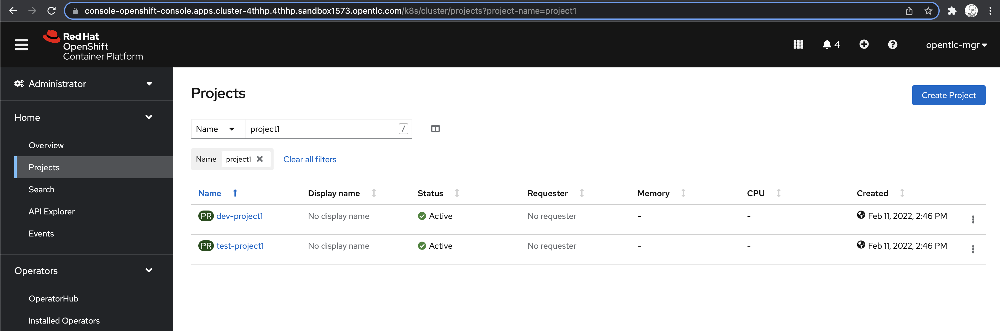

# Paso 1 (Instalación operador `Openshift GitOps)`

1. El operador crea un namespace `openshift-gitops` y dentro un CR `openshift-gitops` (hay que esperar..)

2. Hay que crear un `rbac` con los permisos para que `Openshift GitOps` pueda manipular los namespace.

```sh
oc create -f ocp01/core/rolebinding.yaml
```

# Paso 2 (Configuración)

1. Configuramos `Openshift GitOps` registrando repositorio `openshift-gitops` y secret con las credenciales de acceso al repo GIT

    ```sh
    oc create -f ocp01/core/apps-repository.yaml
    oc create -f ocp01/core/github-ssh-repo-creds.yaml
    ```

2. Registramos proyecto y aplicación en `Openshift GitOps`

    ```sh
    oc create -f ocp01/core/openshift-gitops-project.yaml
    oc create -f ocp01/core/applications.yaml
    ```

    _Esta aplicación es la encargada de monitorear las demás aplicaciónes_

# Paso 3 (Registramos aplicación de prueba)

1. Creamos la imagen para la aplicación de prueba

    ```sh
    oc new-build openshift/python:3.8-ubi8~https://github.com/elsony/devfile-sample-python-basic.git -n openshift
    ```

    _Esto lo hacemos para contar con una imagen de nuestra aplicacion accesible desde cualquier namespace y evitar el proceso de s2i._

2. Crear repo de manifiesto para la aplicación

    Para esto hay que crear un repositorio en github y alojar el contenido de la carpeta `example-gitops`

    

3. Registramos el repositorio para acceder a la aplicación 'example-app'

    ```sh
    oc create -f ocp01/repositories/example-apps-repository.yaml
    ```

4. Creamos el directorio del proyecto

    La información esta separada por `cluster` / `proyecto` / `aplicación`

    ```
    .
    ├── ocp01
    │  ├── proyectos
    │  │  ├── openshift-gitops
    │  │  │  └── rolebinding.yaml
    │  │  ├── project1
    │  │  │  ├── dev
    │  │  │  │  ├── apps
    │  │  │  │  │  └── example-app.yaml
    │  │  │  │  └── project
    │  │  │  │      ├── limit-range.yaml
    │  │  │  │      ├── namespace.yaml
    │  │  │  │      ├── resource-quota.yaml
    │  │  │  │      └── role-binding.yaml
    │  │  │  └── test
    │  │  │      ├── apps
    │  │  │      │  └── example-app.yaml
    │  │  │      └── project
    │  │  │          └── namespace.yaml
    │  │  └── project1-project.yaml
    │  └── repositories
    │      └── example-apps-repository.yaml
    └── ocp03
    ```

    Por ejemplo el proyecto `project1` del cluster `ocp01` esta compuesto de 2 ambientes (`dev` y `test`) y contiene la aplicación `example-app`

    En el ambiente `dev` del projecto `project1` se declara la creación del `namespace` y configuración de `limits`, `quota`, `rolebinding`.

    El cambio en el ambiente de `test` solo se creó el `namespace`

5. Verificación

    Si todo esta bien configurado, deberias ver en la consola de `Openshift GitOps` lo siguiente:

    

    Y en openshift que se crearon los `namespaces` con los objetos declarados en cada uno.

    

    _**Prueba en borrar alguno de estos 2 namespaces! `Openshift GitOps` los va regenerar nuevamente en forma automática. Observa la consola de `Openshift GitOps` para ver el progreso...**_
